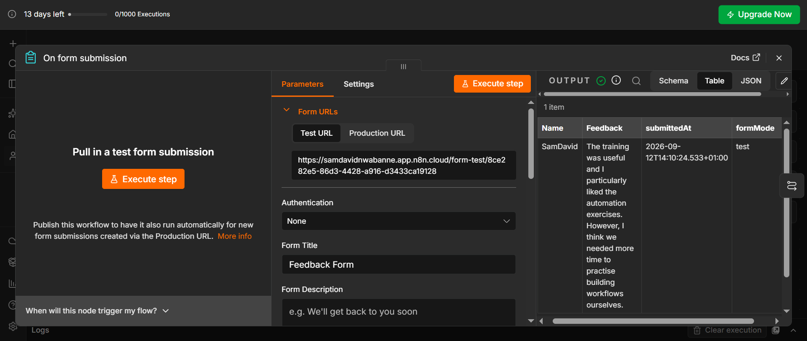
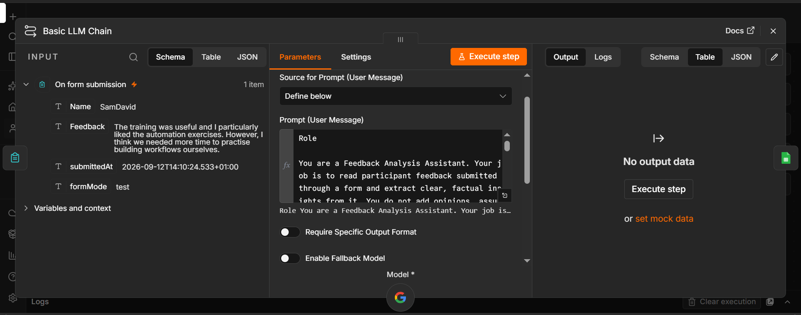
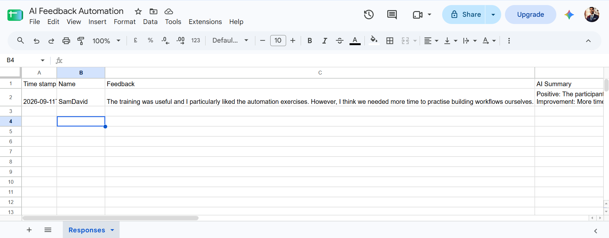

# First AI Automation

## Overview

My first practical AI automation workflow built with n8n.

The workflow receives user feedback, sends it to an AI model for processing and summarisation, and saves the original feedback and generated summary to Google Sheets.

## Workflow

User Input → AI Process → Output

Google Form → n8n → AI Model → Summary → Google Sheets

## How It Works

1. Receive the user's form submission.
2. Extract the user's name and feedback.
3. Send the feedback to an AI model.
4. Use a prompt to instruct the AI on how to process the feedback.
5. Insert the user's feedback dynamically into the prompt.
6. Receive the AI-generated summary.
7. Save the original feedback and summary to Google Sheets.

## Screenshots

### 1. Trigger / Input

The workflow receives the user's name and feedback through the form submission.

### 2. AI Processing

The user's feedback is passed into the AI workflow, where the prompt instructs the AI model to process and summarise it.

### 3. Final Output

The original feedback and AI-generated summary are saved to Google Sheets.

## Key Concepts

- Workflow automation
- AI integration
- Triggers and actions
- Dynamic data
- Prompt engineering
- AI-generated output
- Google Sheets integration

## What I Learned

This project helped me understand how AI can be combined with automation to process information and produce useful outputs with minimal manual work.# First AI Automation

## Overview

My first practical AI automation workflow built with n8n.

The workflow receives user feedback, sends it to an AI model for processing and summarisation, and saves the original feedback and generated summary to Google Sheets.

## Workflow

User Input → AI Process → Output

Google Form → n8n → AI Model → Summary → Google Sheets

## How It Works

1. Receive the user's form submission.
2. Extract the user's name and feedback.
3. Send the feedback to an AI model.
4. Use a prompt to instruct the AI on how to process the feedback.
5. Insert the user's feedback dynamically into the prompt.
6. Receive the AI-generated summary.
7. Save the original feedback and summary to Google Sheets.

## Key Concepts

- Workflow automation
- AI integration
- Triggers and actions
- Dynamic data
- Prompt engineering
- AI-generated output
- Google Sheets integration

## What I Learned

This project helped me understand how AI can be combined with automation to process information and produce useful outputs with minimal manual work.
