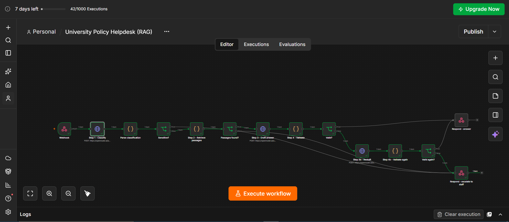
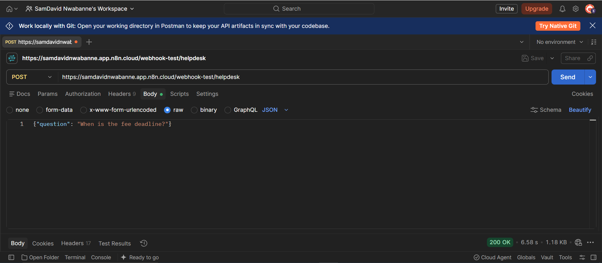
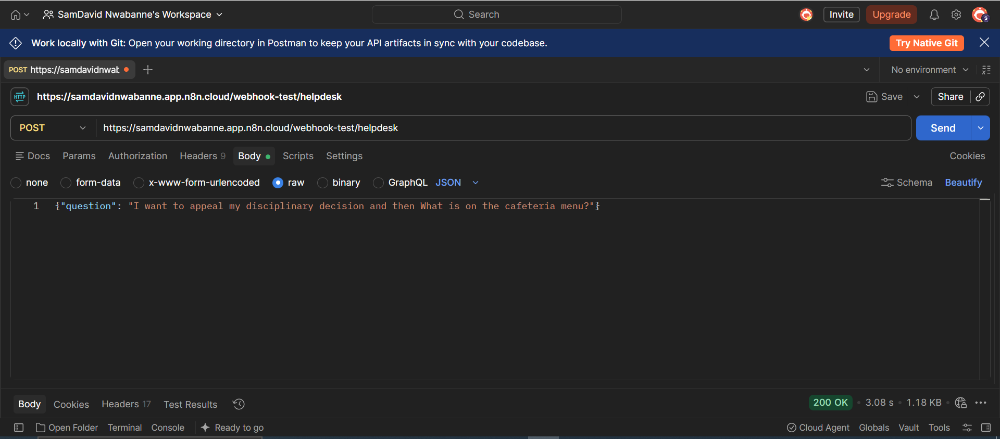

# Day 6: Advanced Prompt Engineering

## What I learned
A good prompt is only one part of a reliable AI app. The context, retrieved information, structured output and validation all shape the result, and human review covers what the model can't.

## Key Takeaways
- An LLM receives more than the user's message. Its context can include system
  instructions, conversation history, retrieved information, tool definitions,
  and the current input.
- Advanced prompt engineering means controlling the instructions, context,
  structure, constraints, and expected output.
- **Prompt chaining** splits a complex task into multiple AI steps.
- **Structured output** (e.g. JSON) lets software read specific fields
  without parsing free text.
- **RAG** supplies relevant external information to the model. It does not
  require an AI agent.
- Reliable systems need testing, validation, good context, and clear
  handling of failure cases.

## Project: University Policy Helpdesk Assistant
**Problem:** Students struggle to find answers in long policy documents, and
staff spend time repeating the same answers.

**Workflow:**
1. Classify the question and flag sensitive topics (LLM, JSON output)
2. Retrieve the top 4 relevant policy passages (RAG)
3. Draft an answer using only the retrieved passages (LLM, JSON output)
4. Validate the schema, the citation, and that the quote is grounded in the source
5. Return the answer with its source, or escalate to a human

## Working Prototype (n8n)
I turned the design into a working workflow in n8n. A webhook receives the
question, then classification, retrieval, drafting and validation run in order,
with one retry before the question is escalated to staff. The model is called
through OpenRouter, and I tested the workflow by sending requests from Postman.

**Answered question:** a fee deadline question passed through every step and
returned a cited answer.

**Escalated question:** a sensitive question was stopped early and passed to
the human staff route instead of getting an AI-written answer.

**Limitation:** retrieval matches keywords against a few sample policies
instead of using a real vector store. A production version would replace
that step.

Workflow export (import it into n8n, then add your own credentials):
[university-helpdesk-rag-workflow.json](../Projects/Images/university-helpdesk-rag-workflow.json)

## Technique Fit
| Technique | Used? | Why |
|---|---|---|
| Prompt chaining | Yes | Separate steps are easier to test and debug |
| Task decomposition | Yes | Triage, retrieve, draft, verify |
| Structured output | Yes | Enables validation and citation display |
| RAG | Yes | Policies change, and answers need sources |
| AI agent | No | The task is predictable, so a fixed workflow is safer and cheaper |

## Failure Points and Safeguards
1. **Wrong or outdated retrieval:** effective dates, similarity threshold,
   retrieval testing
2. **Hallucination:** "answerable: false" option, verbatim quote check, low
   temperature
3. **Sensitive questions:** routed to human staff, keyword backup rules,
   weekly sample review

## Reflection
A reliable LLM app is a designed system, not one clever prompt. Each
component (instructions, retrieval, structure, validation, human review)
covers a weakness of the model. Building it in n8n also showed me how much
of the work is connecting services and debugging credentials, not just
writing prompts.
